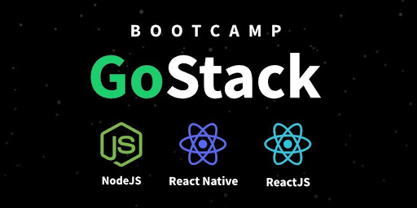

<h1 align="center">
    
</h1>

  

  

  
	
  
  

  
   

# 🚀 Sobre o projeto

Esse repósitorio abrange todo o código produzido durante o bootcamp GoStack da Rocketseat. Este bootcamp é focado no aprendizado do desenvolvimento de um projeto de barbearia nas três frentes: backend, frontend e mobile. Durante a jornada aprendemos sobre Node, React e React Native, bem como diversas ferramentas que apoiam o desenvolvimento e vários padrões de desenvolvimento que auxiliem na manutenibilidade e consistência do app multi-plataforma.

# 📑 Conteúdo

## Level #1: Fundamentos da Stack

- [Conceitos de NodeJS](level1/backend)
- [Conceitos de ReactJS](level1/frontend)
- [Conceitos de React Native](level1/mobile)
- [Typescript](level1/typescript)

## Level #2: NodeJS

- [Fundamentos no backend](level2/backend-fundamentals)
- [Backend GoBarber](level2/backend-gobarber)

## Level #3: Reactjs & React Native

- [Fundamentos no frontend](level3/frontend-fundamentals)
- [Frontend GoBarber](level3/frontend-gobarber)
- [Mobile GoBarber](level3/mobile-gobarber)

## Level #4: Arquitetura e testes com NodeJS

- [Arquitetura/testes no backend](level4/backend-tests)
- [Continuação do backend do GoBarber](level4/backend-gobarber-continuation)
- [Finalização do backend do GoBarber](level4/backend-gobarber-finalize)

## Level #5: Reactjs & React Native: Finalização

- [Finalização do frontend do GoBarber](level5/frontend-gobarber-finalize)
- [Finalização do mobile do GoBarber](level5/mobile-gobarber-finalize)
- [Testes no React](level5/react-tests)

## 📝 Licença

Este projeto esta sob a licença MIT.

Feito com ❤️ por [Paulo Filho](https://www.linkedin.com/in/paulocf92/)!
